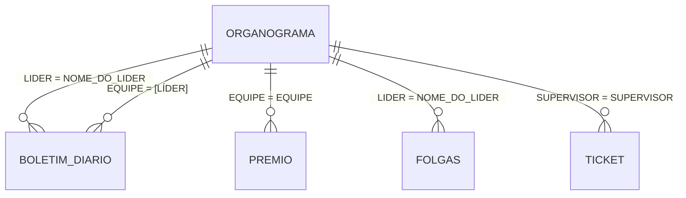

# Apontamentos por equipe — modelo de dados e guia de implementação

Documenta como a tela `/boletins/acompanhar` ("Status Apontamento") do TimberTrack HQ
lê os dados, e como reaproveitar esse modelo em **outro sistema** para responder a
pergunta: *"quando cada equipe apontou pela última vez?"*.

> **Sobre a precisão deste documento:** as colunas listadas foram extraídas das
> queries reais em `server/index.cjs`, não do DDL das tabelas. São as colunas
> **usadas**, não necessariamente todas as que existem. Antes de implementar,
> confirme no banco:
>
> ```sql
> SELECT COLUMN_NAME, DATA_TYPE, IS_NULLABLE
> FROM INFORMATION_SCHEMA.COLUMNS
> WHERE TABLE_NAME = 'BOLETIM_DIARIO'
> ORDER BY ORDINAL_POSITION;
> ```

---

## 1. Arquitetura atual

```
src/routes/boletins.acompanhar.tsx      (React + TanStack Query)
        │
        ├── GET /api/acompanhamento/matriz?mes=YYYY-MM&coord=&sup=
        └── GET /api/acompanhamento/boletins-dia?lider=NOME&data=YYYY-MM-DD
                    │
            server/index.cjs   (Express + mssql)
                    │
              SQL Server
```

Nenhum cálculo de aderência acontece no browser: o endpoint `matriz` devolve a
matriz líder × dia **já montada**, com o estado de cada célula e as métricas.
O front só pinta. É um bom padrão para copiar — a regra de negócio fica em um
lugar só.

---

## 2. As tabelas

Cinco tabelas participam da tela. Nenhuma tem foreign key: **todos os
relacionamentos são por string**, comparadas com `LTRIM(RTRIM(...))`.

### 2.1 `ORGANOGRAMA` — cadastro / hierarquia

A fonte da verdade de **quem existe e quem deve apontar**. Sem ela você só
enxerga quem já apontou, nunca quem sumiu.

| Coluna | Uso |
|---|---|
| `LIDER` | nome da pessoa (chave de ligação com o boletim) |
| `EQUIPE` | código da equipe — **grão mais fino que o líder** |
| `SUPERVISOR`, `COORDENADOR` | hierarquia acima |
| `PROJETO` | projeto da linha (`'400'` é excluído do acompanhamento) |
| `TREINADO` (`'SIM'`) | se o líder já foi treinado a lançar prêmio |
| `DATA_COBRANCA` | a partir de quando o prêmio passa a ser cobrado dele |
| `SUPERVISOR_TREINADO`, `SUPERVISOR_DATA_TREINAMENTO` | idem, para a "estrutura" do supervisor |
| `APONTADOR` | quem de fato lança, quando não é o próprio líder (ex.: PCP) |
| `COBRANCA_PAUSADA` | pausa temporária da cobrança |

Cardinalidade importante: **um líder pode ter várias linhas** (um par
`LIDER × PROJETO` por projeto, e várias `EQUIPE`). A tela atual gera uma linha do
heatmap por `(SUPERVISOR, LIDER, PROJETO)`.

### 2.2 `BOLETIM_DIARIO` — o fato (apontamento de produção)

A tabela central. Ela é **denormalizada**: cada boletim carrega sua própria
hierarquia, então dá para responder muita coisa sem tocar no `ORGANOGRAMA`.

| Coluna | Observação |
|---|---|
| `ID` | identity, crescente — único proxy de ordem de inserção |
| `NOME_DO_LIDER` | **a pessoa** |
| `[LÍDER]` | ⚠️ **a equipe** (código), *não* a pessoa — ver armadilha 3.1 |
| `[DATA_EXECUÇÃO]` | data do trabalho executado |
| `PROJETO`, `COORDENADOR`, `SUPERVISOR` | hierarquia copiada no momento do lançamento |
| `[SERVIÇO]`, `COD` | atividade executada |
| `FAZENDA`, `TALHAO` | local |
| `[PRODUÇÃO]` | quantidade produzida |
| `STATUS` | `'FINALIZADO TOTAL'` / `'FINALIZADO PARCIAL'` / … |
| `DISTRIBUIDO_PREMIO` | `'SIM'` distribuído · `'NÃO'` não se aplica · **vazio/NULL = pendente** |
| `OS_INTERNA` | ordem de serviço (`'AVULSO'` quando nula) |
| `INSUMO1..8` / `QUANTIDADE1..8` | 8 slots de insumo (ver `INS_SLOTS`, [index.cjs:579](../server/index.cjs#L579)) |

> **Não existe coluna de data de criação.** `CRIADO_EM` aparece em outras tabelas
> (`NOTIFICACOES_PCP`, `PAINEL_USUARIOS`), mas não no `BOLETIM_DIARIO`. Isso tem
> consequência direta no seu caso de uso — ver 4.5.

### 2.3 `FOLGAS` — os dias que não são cobrados

| Coluna | Uso |
|---|---|
| `NOME_DO_LIDER` | pessoa |
| `DATA` | dia |
| `EVENTO` | `FOLGA`, `SEM ATIVIDADE`, `NÃO APLICA`, `ATESTADO`, `FÉRIAS`, `VIAGEM`, `LICENÇA`, `ANTECIPAÇÃO`… |
| `MOTIVO` | texto livre, mostrado no popover |

Sem consultar essa tabela, qualquer relatório de "equipe parada" vai acusar
falso positivo em férias, atestado e feriado.

### 2.4 `TICKET` — estrutura enviada pelo supervisor

Filtrada por `TIPO = 'ALOCACAO'`. Colunas usadas: `SUPERVISOR`, `COORDENADOR`,
`DATA`, `TIPO`. É o que alimenta a linha azul "Estrutura" acima de cada grupo de
líderes. Só é relevante se você quiser replicar a cobrança do supervisor.

### 2.5 `PREMIO` — distribuição de prêmio

Usada apenas no popup de detalhe. Colunas: `ID`, `COLABORADOR`, `CPF`, `PROJETO`,
`EQUIPE`, `ATIVIDADE_EXECUTADA`, `META`, `PRODUCAO_DO_DIA`,
`PORCENTAGEM_PRODUCAO`, `VALOR_A_RECEBER`, `RECEBE_PREMIO`, `APROVADO`, `DATA`.

**`PREMIO` não tem coluna de líder.** O vínculo pessoa → prêmio passa
obrigatoriamente por `EQUIPE`, com subquery no `ORGANOGRAMA`
([index.cjs:4286](../server/index.cjs#L4286)):

```sql
WHERE LTRIM(RTRIM(p.EQUIPE)) IN (
        SELECT DISTINCT LTRIM(RTRIM(o.EQUIPE))
        FROM ORGANOGRAMA o
        WHERE LTRIM(RTRIM(o.LIDER)) = @lider
      )
```

### 2.6 Mapa de ligações



Todas as arestas são **strings sem FK, sem índice garantido**.

---

## 3. Armadilhas do schema

Estas custam caro se descobertas em produção.

### 3.1 `[LÍDER]` ≠ `NOME_DO_LIDER`

Dentro do `BOLETIM_DIARIO`:

- `NOME_DO_LIDER` = **nome da pessoa** (`"JOÃO DA SILVA"`)
- `[LÍDER]` = **código da equipe** (o que o `ORGANOGRAMA` chama de `EQUIPE`)

Confirmado em [index.cjs:659](../server/index.cjs#L659) — o filtro de equipe da
tela Produção é `LTRIM(RTRIM([LÍDER])) = @equipe`.

Pior: a base tem dados sujos o bastante para o próprio código defender-se com um
`OR` ([index.cjs:4473](../server/index.cjs#L4473)):

```sql
WHERE (b.[LÍDER] = @lider OR b.NOME_DO_LIDER = @lider)
```

Adote a mesma defesa, e considere normalizar isso na origem.

### 3.2 Colunas com acento exigem colchetes

`[DATA_EXECUÇÃO]`, `[PRODUÇÃO]`, `[SERVIÇO]`, `[LÍDER]`. Dependendo do driver e
do collation, esquecer o colchete falha de formas pouco óbvias.

### 3.3 Espaço em branco em todo lugar

Todo join e todo filtro no código usa `LTRIM(RTRIM(col))`. Não é preciosismo — a
base tem padding. Copie o hábito ou normalize na ingestão.

### 3.4 Fuso horário

O servidor pode rodar em UTC. O código calcula "hoje" explicitamente em Brasília
([index.cjs:1390](../server/index.cjs#L1390)):

```js
const hoje = new Date(new Date().toLocaleString("en-US", { timeZone: "America/Sao_Paulo" }));
```

`GETDATE()` no SQL Server devolve a hora do servidor. Prefira **calcular a data
de referência na aplicação e passar como parâmetro**.

### 3.5 O dia corrente não conta

A tela usa `diaCorte = hoje - 1` no mês atual. Boletim do dia ainda está sendo
lançado; cobrar hoje gera vermelho falso todo santo dia. Replique essa ideia.

---

## 4. Implementando "últimos apontamentos de cada equipe"

Esta é a parte prática. O objetivo é diferente do heatmap mensal: em vez de
"aderência no mês", você quer **um radar de equipes paradas**.

### 4.1 A decisão de grão

Escolha explicitamente o que é uma "equipe" no seu sistema:

| Grão | Chave | Quando usar |
|---|---|---|
| Equipe (código) | `BOLETIM_DIARIO.[LÍDER]` = `ORGANOGRAMA.EQUIPE` | **recomendado** — é o grão que o prêmio usa |
| Pessoa | `BOLETIM_DIARIO.NOME_DO_LIDER` = `ORGANOGRAMA.LIDER` | quando a cobrança é individual |
| Equipe × Projeto | par das duas | quando a mesma equipe atua em projetos distintos |

O resto deste guia usa **equipe**.

### 4.2 Query principal — última execução por equipe

O ponto crucial: partir do **`ORGANOGRAMA`** com `OUTER APPLY`, não do
`BOLETIM_DIARIO` com `GROUP BY`. Uma equipe que nunca apontou não tem linha no
boletim — e é exatamente a que você mais precisa ver.

```sql
DECLARE @hoje date = @dataRef;   -- calculado na app, fuso Brasília

WITH equipes AS (
  SELECT DISTINCT
    LTRIM(RTRIM(o.EQUIPE))                  AS EQUIPE,
    LTRIM(RTRIM(o.LIDER))                   AS LIDER,
    LTRIM(RTRIM(ISNULL(o.SUPERVISOR, '')))  AS SUPERVISOR,
    LTRIM(RTRIM(ISNULL(o.COORDENADOR, ''))) AS COORDENADOR,
    LTRIM(RTRIM(ISNULL(o.PROJETO, '')))     AS PROJETO
  FROM ORGANOGRAMA o
  WHERE o.EQUIPE IS NOT NULL AND LTRIM(RTRIM(o.EQUIPE)) <> ''
    AND o.LIDER  IS NOT NULL AND LTRIM(RTRIM(o.LIDER))  <> ''
    AND LTRIM(RTRIM(ISNULL(o.PROJETO, ''))) <> '400'
    AND ISNULL(o.COBRANCA_PAUSADA, 0) = 0
)
SELECT
  e.EQUIPE, e.LIDER, e.SUPERVISOR, e.COORDENADOR, e.PROJETO,
  u.DATA_EXECUCAO                                   AS ULTIMO_APONTAMENTO,
  u.ID                                              AS ULTIMO_BOLETIM_ID,
  u.SERVICO, u.FAZENDA, u.TALHAO, u.PRODUCAO, u.STATUS,
  DATEDIFF(day, u.DATA_EXECUCAO, @hoje)             AS DIAS_PARADO
FROM equipes e
OUTER APPLY (
  SELECT TOP 1
    CONVERT(date, b.[DATA_EXECUÇÃO]) AS DATA_EXECUCAO,
    b.ID,
    b.[SERVIÇO]  AS SERVICO,
    b.FAZENDA, b.TALHAO,
    b.[PRODUÇÃO] AS PRODUCAO,
    b.STATUS
  FROM BOLETIM_DIARIO b
  WHERE LTRIM(RTRIM(b.[LÍDER])) = e.EQUIPE
    AND b.[DATA_EXECUÇÃO] < DATEADD(day, 1, @hoje)   -- ignora lançamento futuro
  ORDER BY b.[DATA_EXECUÇÃO] DESC, b.ID DESC
) u
ORDER BY
  CASE WHEN u.DATA_EXECUCAO IS NULL THEN 0 ELSE 1 END,  -- nunca apontou primeiro
  u.DATA_EXECUCAO ASC;                                   -- depois, mais parado
```

`OUTER APPLY` (não `CROSS APPLY`) é o que preserva a equipe sem nenhum boletim —
ela volta com `ULTIMO_APONTAMENTO = NULL`.

O `ORDER BY` final já entrega a lista na ordem de urgência: nunca apontou →
parado há mais tempo → em dia.

### 4.3 Descontando folgas

`DIAS_PARADO` cru mente: equipe em férias aparece como crítica. Traga os eventos
da janela e desconte na aplicação:

```sql
SELECT
  LTRIM(RTRIM(NOME_DO_LIDER))       AS LIDER,
  CONVERT(date, DATA)               AS DIA,
  LTRIM(RTRIM(ISNULL(EVENTO, '')))  AS EVENTO,
  LTRIM(RTRIM(ISNULL(MOTIVO, '')))  AS MOTIVO
FROM FOLGAS
WHERE DATA >= DATEADD(day, -@janela, @hoje)
  AND DATA <  DATEADD(day, 1, @hoje);
```

Note que `FOLGAS` é por **pessoa** (`NOME_DO_LIDER`), enquanto o radar é por
**equipe** — a ponte é `ORGANOGRAMA.LIDER → ORGANOGRAMA.EQUIPE`. Uma equipe só
está legitimamente parada se o líder dela tem evento naquele dia.

Regra sugerida para o semáforo, já com folga e fim de semana descontados:

| Dias úteis sem apontar | Estado |
|---|---|
| 0–1 | 🟢 em dia |
| 2–3 | 🟡 atenção |
| 4+ | 🔴 crítico |
| sem nenhum boletim | ⚫ nunca apontou |

### 4.4 Timeline / drill-down de uma equipe

```sql
SELECT TOP (@n)
  b.ID,
  CONVERT(date, b.[DATA_EXECUÇÃO]) AS DATA_EXECUCAO,
  b.PROJETO, b.FAZENDA, b.TALHAO,
  b.[SERVIÇO]  AS SERVICO,
  b.[PRODUÇÃO] AS PRODUCAO,
  b.STATUS,
  b.DISTRIBUIDO_PREMIO,
  b.NOME_DO_LIDER
FROM BOLETIM_DIARIO b
WHERE (LTRIM(RTRIM(b.[LÍDER])) = @equipe          -- código da equipe
    OR LTRIM(RTRIM(b.NOME_DO_LIDER)) = @equipe)   -- fallback: base suja (3.1)
ORDER BY b.[DATA_EXECUÇÃO] DESC, b.ID DESC;
```

### 4.5 Mini-heatmap dos últimos N dias

Se quiser reproduzir o visual da tela em escala reduzida (sparkline por equipe):

```sql
SELECT
  LTRIM(RTRIM(b.[LÍDER]))                  AS EQUIPE,
  CONVERT(date, b.[DATA_EXECUÇÃO])         AS DIA,
  COUNT(*)                                 AS QTD_BOLETINS,
  SUM(TRY_CONVERT(float, b.[PRODUÇÃO]))    AS PRODUCAO,
  SUM(CASE WHEN b.STATUS IN ('FINALIZADO TOTAL', 'FINALIZADO PARCIAL')
            AND (b.DISTRIBUIDO_PREMIO IS NULL OR LTRIM(RTRIM(b.DISTRIBUIDO_PREMIO)) = '')
           THEN 1 ELSE 0 END)              AS PREMIO_PENDENTE
FROM BOLETIM_DIARIO b
WHERE b.[DATA_EXECUÇÃO] >= DATEADD(day, -@janela, @hoje)
  AND b.[DATA_EXECUÇÃO] <  DATEADD(day, 1, @hoje)
GROUP BY LTRIM(RTRIM(b.[LÍDER])), CONVERT(date, b.[DATA_EXECUÇÃO]);
```

> **"Último apontamento" tem duas leituras.** Como não há coluna de criação, você
> só consegue *data de execução do trabalho* (`[DATA_EXECUÇÃO]`), não *momento do
> lançamento*. Uma equipe pode lançar hoje três boletins retroativos da semana
> passada — pelo `[DATA_EXECUÇÃO]` ela parece parada há 7 dias.
>
> O `ID` (identity crescente) é o único proxy de ordem de inserção: `MAX(ID)` por
> equipe aproxima "quem lançou por último". Se o lançamento retroativo importa no
> seu caso, exponha as duas métricas — ou adicione um `CRIADO_EM` na origem.

### 4.6 Contrato de API sugerido

```
GET /api/equipes/ultimos-apontamentos?coord=&sup=&projeto=&janela=30
```

```jsonc
{
  "geradoEm": "2026-08-04T09:12:00-03:00",
  "dataRef": "2026-08-03",
  "equipes": [
    {
      "equipe": "EQ-014",
      "lider": "JOÃO DA SILVA",
      "supervisor": "MARIA SOUZA",
      "coordenador": "CARLOS LIMA",
      "projeto": "301",
      "ultimoApontamento": "2026-07-28",
      "diasParado": 6,
      "diasUteisParado": 4,
      "estado": "critico",           // ok | atencao | critico | nunca | folga
      "eventoAtual": null,           // { evento, motivo } quando em folga/férias
      "ultimo": {
        "id": 918233,
        "servico": "ROÇADA MANUAL",
        "fazenda": "SÃO JOSÉ",
        "talhao": "12B",
        "producao": 4.5,
        "status": "FINALIZADO TOTAL"
      },
      "ultimos15dias": [
        { "dia": "2026-07-28", "qtd": 2, "premioPendente": 1 }
      ]
    }
  ]
}
```

Mantenha o cálculo do estado **no servidor**, como o TimberTrack faz. O cliente
não deve saber o que é `DISTRIBUIDO_PREMIO`.

### 4.7 Performance

Três equipes de cuidado, em ordem de impacto:

1. **Índice.** `OUTER APPLY` com `TOP 1` por equipe faz N seeks. Sem índice, N
   scans na tabela de fatos:
   ```sql
   CREATE NONCLUSTERED INDEX IX_BOLETIM_LIDER_DATA
     ON BOLETIM_DIARIO ([LÍDER], [DATA_EXECUÇÃO] DESC)
     INCLUDE (ID, STATUS, DISTRIBUIDO_PREMIO, PROJETO);
   ```
   O `LTRIM(RTRIM([LÍDER])) = e.EQUIPE` **invalida o seek** nesse índice. Se a
   performance apertar, normalize o padding na ingestão e compare a coluna crua,
   ou crie uma coluna computada persistida com índice.

2. **Range de data sargable.** Prefira
   `b.[DATA_EXECUÇÃO] >= @de AND b.[DATA_EXECUÇÃO] < DATEADD(day,1,@ate)` a
   `CONVERT(date, b.[DATA_EXECUÇÃO]) BETWEEN ...`.

3. **Cache.** O dado muda algumas vezes por dia. A tela original usa
   `staleTime: 60_000` no cliente; um cache de 1–5 min no servidor resolve o
   grosso da carga.

### 4.8 Escopo e segurança

O TimberTrack aplica **defesa em profundidade**: o filtro de projeto do usuário
entra em *toda* query, mesmo quando o front já filtrou
([`escopoProjetos`](../server/index.cjs#L169)). A regra é explícita:

> a lista que o cliente manda só pode **reduzir** o escopo, nunca ampliá-lo.

Se o seu sistema tem hierarquia de acesso, replique isso — não confie no filtro
que veio na query string. E mantenha o padrão de **binding parametrizado**: o
código nunca concatena nome em SQL, gera `@lid0, @lid1, …` dinamicamente
([index.cjs:1442](../server/index.cjs#L1442)).

---

## 5. Regras de negócio da tela original

Guardadas aqui para referência — úteis se você for além do "último apontamento"
e quiser replicar a cobrança completa.

### 5.1 Estados da célula

| Estado | Visual | Significado | Pontos |
|---|---|---|---|
| `a` | 🟩 ✓ | boletim + prêmio ok | 1/1 ou 2/2 |
| `ap` | 🟥 P | boletim lançado, prêmio pendente | 1/2 |
| `n` | 🟥 B/P | não apontou (líder treinado) | 0/2 |
| `nb` | 🟥 B | não apontou (não treinado — só deve boletim) | 0/1 |
| `f` | 🟩 F | folga / evento — não cobrado | — |
| `x` | ⬜ | dia futuro | — |

### 5.2 Quando o prêmio é cobrado

`cobraPremio()` ([index.cjs:1572](../server/index.cjs#L1572)) — todas precisam ser verdadeiras:

1. `COBRANCA_PAUSADA` = 0
2. líder **não** começa com `T_` (terceiros nunca pagam prêmio)
3. `TREINADO = 'SIM'`
4. `DATA_COBRANCA` preenchida **e** o dia analisado é `>= DATA_COBRANCA`

E o prêmio só entra como *pendente* se existir boletim `FINALIZADO TOTAL/PARCIAL`
com `DISTRIBUIDO_PREMIO` vazio. `'SIM'` e `'NÃO'` não cobram.

### 5.3 Líder com mais de um projeto

Se o líder tem **1** projeto no `ORGANOGRAMA`, qualquer boletim dele conta —
cobre a troca de projeto no meio do mês. Se tem **vários** simultâneos, cada
linha só aceita boletim do seu próprio projeto
([index.cjs:1616](../server/index.cjs#L1616)).

### 5.4 Estrutura do supervisor

Linha azul acima de cada grupo. Cobra `TICKET` com `TIPO = 'ALOCACAO'` no dia.
Não é cobrada antes de `SUPERVISOR_DATA_TREINAMENTO` (mostra `NT`), nem em dias
em que **todos** os líderes estão de folga.

---

## 6. Checklist de implementação

- [ ] Rodar `INFORMATION_SCHEMA.COLUMNS` e confirmar as colunas reais
- [ ] Decidir o grão: equipe, pessoa, ou equipe × projeto (4.1)
- [ ] Query principal com `OUTER APPLY` partindo do `ORGANOGRAMA` (4.2)
- [ ] Tratar `[LÍDER]` vs `NOME_DO_LIDER`, com o `OR` defensivo (3.1)
- [ ] Trazer `FOLGAS` e descontar do `diasParado` (4.3)
- [ ] Calcular a data de referência em Brasília, na aplicação (3.4)
- [ ] Excluir o dia corrente da cobrança (3.5)
- [ ] Excluir `PROJETO = '400'` se a regra valer no seu contexto
- [ ] Criar o índice `([LÍDER], [DATA_EXECUÇÃO] DESC)` (4.7)
- [ ] Aplicar escopo de acesso no servidor, sem confiar na query string (4.8)
- [ ] Cache de 1–5 min

---

## 7. Referências no código

| O quê | Onde |
|---|---|
| Componente da tela | [src/routes/boletins.acompanhar.tsx](../src/routes/boletins.acompanhar.tsx) |
| Endpoint da matriz | [server/index.cjs:1379](../server/index.cjs#L1379) |
| Endpoint do popup | [server/index.cjs:4251](../server/index.cjs#L4251) |
| Regra de cobrança de prêmio | [server/index.cjs:1572](../server/index.cjs#L1572) |
| Regra de cobrança de estrutura | [server/index.cjs:1586](../server/index.cjs#L1586) |
| Escopo de acesso por projeto | [server/index.cjs:169](../server/index.cjs#L169) |
| Filtro por equipe (`[LÍDER]`) | [server/index.cjs:659](../server/index.cjs#L659) |
| Fallback equipe/pessoa | [server/index.cjs:4473](../server/index.cjs#L4473) |
| Slots de insumo | [server/index.cjs:579](../server/index.cjs#L579) |
